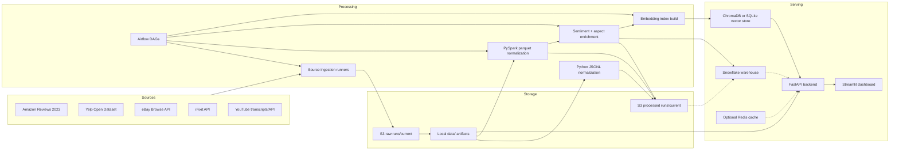
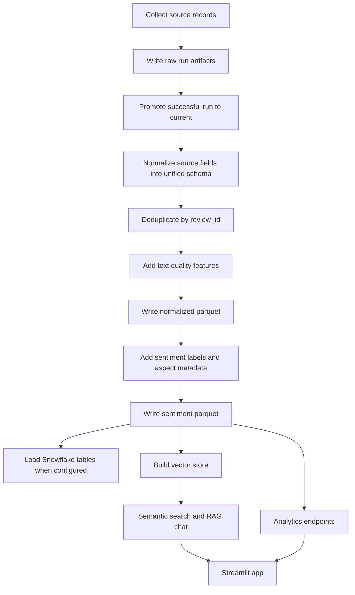
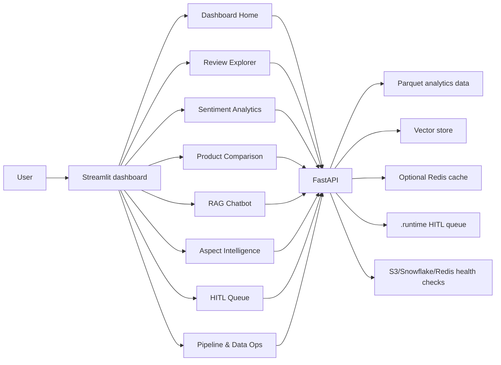

# ReviewPulse AI
 
**Cross-Platform Product Review Intelligence**
 
DAMG 7245 - Big Data and Intelligent Analytics | Northeastern University | Spring 2026
 
ReviewPulse AI is a data engineering and analytics application for collecting product and service reviews from multiple platforms, normalizing them into a shared schema, enriching them with sentiment and aspect signals, indexing them for semantic search, and exposing the result through a FastAPI backend and Streamlit dashboard.
 
The application is built to answer review-grounded questions such as:
 
- What are customers complaining about across Amazon, Yelp, eBay, iFixit, and YouTube?
- Which products or businesses have the strongest positive or negative sentiment?
- Which aspects, such as battery, support, repairability, price, or service, drive sentiment?
- Can a chatbot answer review questions with citations instead of unsupported claims?
 
The project is data-first. Ingestion, storage, Spark normalization, data quality checks, sentiment scoring, aspect extraction, embeddings, retrieval, and observability are the core system. The LLM-backed answer layer is optional and falls back to deterministic summaries when no external LLM key is configured.
 
## Submission Links
 
| Requirement | Link / Status |
| --- | --- |
| GitHub Repository | This repository |
| Backend | https://reviewpulse-api-3ogueqhipq-uc.a.run.app/docs |
| Frontend | https://reviewpulse-ai.streamlit.app |
| Codelabs | |
| Video Demo on YouTube | |
 
## Final Project Checklist
 
| Requirement | How This Repository Addresses It |
| --- | --- |
| Detailed GitHub README | This file documents setup, architecture, data flow, user flow, services, testing, deployment, metrics, and disclosures. |
| Architecture and data/user flow diagrams | Tracked diagrams are in `docs/`; Mermaid diagrams are included below for GitHub rendering. |
| GitHub Project Tracker | The ReviewPulse AI Project Tracker Kanban board is fully closed out; all tracked items are marked `Done`. |
| Codelabs journey documentation | A Codelabs link placeholder is included above; the README also summarizes the project journey and challenges. |
| Cloud deployment | FastAPI is deployed on Google Cloud Run; Streamlit is deployed publicly on Streamlit Cloud. |
| Unit and integration testing | `tests/` contains 73 tests covering normalization, ingestion, storage, Spark runtime, ML backends, retrieval, API health, app analytics, Airflow DAG wiring, Snowflake SQL, guardrails, fake-review filtering, cache keys, and HITL queue behavior. |
| Video demo | A video link placeholder is included above. |
| Work disclosure | Attestation, contribution percentages, and AI usage disclosure are included near the end of this README. |
 
## Project Tracking Status
 
The GitHub Projects Kanban board for `ReviewPulse AI - Project Tracker` is complete. All backlog and implementation items shown on the board are closed with status `Done`, including ingestion, Spark normalization, Airflow orchestration, S3/Snowflake integration, sentiment scoring, embeddings, Streamlit UI, FastAPI endpoints, guardrails, testing, production deployment, Codelabs/video preparation, and final transformer/runtime fixes.
 
## Live Application
 
| Surface | URL | Notes |
| --- | --- | --- |
| Streamlit Dashboard | https://reviewpulse-ai.streamlit.app | Main user interface for analytics, review exploration, RAG chat, source metrics, and pipeline status. |
| FastAPI Backend | https://reviewpulse-api-3ogueqhipq-uc.a.run.app | Public API used by the dashboard. |
| Swagger / OpenAPI | https://reviewpulse-api-3ogueqhipq-uc.a.run.app/docs | Interactive API documentation. |
| Lightweight Health | https://reviewpulse-api-3ogueqhipq-uc.a.run.app/health | Runtime flags and cache status. |
| Detailed Health | https://reviewpulse-api-3ogueqhipq-uc.a.run.app/health/detailed | S3, Snowflake, Redis, and app health checks. |
 
Deployment model:
 
- Backend: FastAPI + Uvicorn container on Google Cloud Run.
- Frontend: Streamlit Cloud app configured with `API_BASE_URL`.
- Data services: local/generated parquet artifacts, optional S3 artifact publishing, optional Snowflake warehouse load, optional Redis response cache.
- ML services: local sentiment/aspect/embedding backends with optional Anthropic API for generated chat answers.
 
## Core Capabilities
 
| Area | What Is Implemented |
| --- | --- |
| Multi-source ingestion | Amazon Reviews 2023 streaming, Yelp Open Dataset staging, eBay Browse API, iFixit guide API, YouTube transcripts and metadata, optional Reddit POC connector. |
| Run-based storage | S3 `raw/<source>/runs/<run_id>/`, `raw/<source>/current/`, `processed/<stage>/runs/<run_id>/`, `processed/<stage>/current/`, plus `_LATEST_RUN.json` markers. |
| Normalization | Python and PySpark normalizers convert heterogeneous source records into one review schema. |
| Feature engineering | Text word count, character count, capitalization ratio, exclamation ratio, deduplication by `review_id`. |
| Sentiment enrichment | Transformer sentiment model when available; deterministic lexicon fallback when transformers cannot load. |
| Aspect extraction | Heuristic extraction by default; optional Ollama-backed extraction for local LLM aspect extraction. |
| Embeddings and retrieval | `sentence-transformers/all-MiniLM-L6-v2` by default; deterministic hashing fallback; ChromaDB or SQLite FTS/vector fallback depending on platform/config. |
| Grounded chat | Guardrailed `/chat` endpoint retrieves review evidence, optionally calls Anthropic, and returns citations. |
| Fake-review risk filtering | Deterministic rules flag promotional language, repeated terms, excessive punctuation/caps, URLs/contact info, and generic superlatives. |
| HITL queue | Low-confidence queries can be written to `.runtime/hitl_queue.jsonl` and viewed in the UI. |
| Analytics | Dashboard KPIs, review explorer, sentiment charts, product comparisons, aspect summaries, source overview, data profile, quality metrics, pipeline status. |
| Orchestration | Airflow DAGs for full ingestion/processing and reprocessing-only workflows. |
| Observability | Structured JSON logging with run id, DAG id, task id, stage, source, counts, durations, and failure metadata. |
 
## Current Dataset Snapshot
 
The local final-demo parquet artifacts contain 8,148,920 normalized and sentiment-scored rows. These generated artifacts are not expected to be committed to GitHub; they are produced by the pipeline and used by the running application.
 
## Architecture
 
Tracked project diagrams:
 

 

 
### System Architecture
 

 
Dotted lines indicate optional health, warehouse-load, or cache relationships rather than the primary local parquet/vector serving path.
 
### Data Flow
 

 
### User Flow
 

 
## Data Sources
 
| Source | Implementation | Config / Access | Output |
| --- | --- | --- | --- |
| Amazon Reviews 2023 | `src/ingestion/amazon.py` streams Hugging Face dataset batches, writes checkpoints, resumes incomplete runs, and publishes S3 raw artifacts. | `AMAZON_DATASET_NAME`, `AMAZON_CATEGORY`, `AMAZON_BATCH_SIZE`, optional `HUGGINGFACE_TOKEN`. | Batched JSONL plus manifest under `data/amazon/runs/<run_id>/` and S3 raw prefixes. |
| Yelp Open Dataset | `src/ingestion/yelp.py` stages official review/business JSON files from local path or S3 URI. | `YELP_DATASET_PATH` or `YELP_DATASET_S3_URI`. | Official review and business files plus manifest. |
| eBay | `src/ingestion/ebay.py` calls OAuth + Browse API search/category endpoints and maps item summaries. | `EBAY_APP_ID`, `EBAY_CERT_ID`, `EBAY_SEARCH_QUERIES` or `EBAY_CATEGORY_IDS`. | `ebay_listings.jsonl`. |
| iFixit | `src/ingestion/ifixit.py` calls the iFixit guide API and extracts repair guide fields. | `IFIXIT_GUIDE_IDS`, optional `IFIXIT_BASE_URL`. | `ifixit_guides.jsonl`. |
| YouTube | `src/ingestion/youtube.py` resolves video IDs, optionally searches via YouTube API, fetches transcripts, and enriches with oEmbed/API metadata. | `YOUTUBE_VIDEO_IDS` or `YOUTUBE_SEARCH_QUERIES`; `YOUTUBE_API_KEY` required for search/API metadata. | `youtube_reviews.jsonl`. |
 
## Unified Schema
 
All sources are normalized into this core schema:
 
```text
review_id
product_name
product_category
source
rating_normalized
review_text
review_date
reviewer_id
verified_purchase
helpful_votes
source_url
display_name
display_category
entity_type
text_length_words
```
 
Spark adds additional feature columns:
 
```text
text_length_chars
caps_ratio
exclamation_ratio
```
 
Sentiment scoring adds:
 
```text
aspect_labels
aspect_count
aspect_details_json
sentiment_label
sentiment_score
```
 
Rating normalization:
 
| Source | Raw Rating Field | Normalized Formula |
| --- | --- | --- |
| Amazon | `rating` from 1 to 5 | `(rating - 1) / 4` |
| Yelp | `stars` from 1 to 5 | `(stars - 1) / 4` |
| eBay | `seller_rating` from 0 to 100 | `seller_rating / 100` |
| iFixit | `repairability_score` from 1 to 10 | `(repairability_score - 1) / 9` |
| YouTube | No native rating | `null` |
 
## Technology Stack
 
| Layer | Tools |
| --- | --- |
| Language and packaging | Python 3.11+, Poetry |
| Batch processing | PySpark, PyArrow parquet |
| Data lake | AWS S3 run/current prefixes, local `data/` artifacts |
| Warehouse | Snowflake external stage + parquet `COPY INTO` |
| Orchestration | Apache Airflow DAGs and Docker Compose |
| Sentiment | Hugging Face transformers when available, lexicon fallback otherwise |
| Aspect extraction | Heuristic extractor, optional Ollama/Llama 3.1 |
| Embeddings | sentence-transformers, hashing fallback |
| Vector storage | ChromaDB or SQLite-backed local vector/FTS store |
| API | FastAPI, Pydantic, Uvicorn |
| Frontend | Streamlit |
| Cache | Optional Redis JSON cache |
| Optional generated chat | Anthropic API |
| Testing | pytest, pytest-cov, ruff, mypy |
 
## Repository Structure
 
```text
reviewpulse-ai/
|-- dags/
|   |-- dag_ingestion.py              # Full ingestion + processing DAG
|   `-- dag_reprocessing.py           # Rebuild normalized/sentiment/vector artifacts
|-- docker/airflow/
|   |-- Dockerfile
|   |-- docker-compose.yaml
|   |-- docker-compose.deploy.yaml
|   |-- bootstrap-project-venv.sh
|   `-- run-airflow-standalone.sh
|-- docs/
|   |-- Architecture Diagram.png
|   |-- Data Flow Diagram.png
|   |-- ReviewPulse_AI_Final_Project_Proposal.docx
|   `-- ReviewPulse_AI_Final_Project_Proposal.pdf
|-- poc/
|   |-- aspect_extraction.py
|   |-- eda_amazon.py
|   |-- normalize_schema.py
|   |-- reddit_connector.py
|   `-- youtube_extractor.py
|-- results/
|   |-- eda_rating_distribution.png
|   |-- eda_review_length.png
|   |-- eda_temporal_distribution.png
|   |-- eda_top_products.png
|   `-- eda_verified_vs_rating.png
|-- src/
|   |-- api/main.py
|   |-- app_logic/
|   |   |-- cache.py
|   |   |-- fake_detection.py
|   |   |-- guardrails.py
|   |   `-- hitl.py
|   |-- common/
|   |   |-- run_context.py
|   |   |-- settings.py
|   |   |-- spark_runtime.py
|   |   |-- storage.py
|   |   `-- structured_logging.py
|   |-- frontend/app.py
|   |-- ingestion/
|   |   |-- amazon.py
|   |   |-- ebay.py
|   |   |-- ifixit.py
|   |   |-- yelp.py
|   |   `-- youtube.py
|   |-- insights/
|   |   |-- app_analytics.py
|   |   |-- arrow_metrics.py
|   |   |-- data_profile.py
|   |   |-- normalization_explainer.py
|   |   |-- quality_metrics.py
|   |   `-- source_comparison.py
|   |-- ml/
|   |   |-- aspect_extraction.py
|   |   |-- sentiment_backend.py
|   |   `-- sentiment_scoring.py
|   |-- normalization/core.py
|   |-- retrieval/
|   |   |-- build_embeddings.py
|   |   |-- embedding_backend.py
|   |   |-- query_reviews.py
|   |   `-- sqlite_vector_store.py
|   |-- spark/normalize_reviews_spark.py
|   `-- warehouse/snowflake_loader.py
|-- tests/
|-- .env.example
|-- pyproject.toml
|-- poetry.lock
|-- run.sh
`-- README.md
```
 
## Local Setup
 
### Prerequisites
 
- Python 3.11, 3.12, or 3.13
- Poetry
- Java runtime for PySpark
- Optional Docker for Airflow
- Optional AWS credentials and S3 bucket for end-to-end ingestion/publishing
- Optional Snowflake account for warehouse loading
- Optional Redis for API caching
- Optional Ollama for local LLM aspect extraction
- Optional Anthropic API key for generated chat answers
 
### Install
 
```bash
git clone https://github.com/<your-org-or-user>/reviewpulse-ai.git
cd reviewpulse-ai
poetry install --no-root
```
 
Create an environment file:
 
```bash
cp .env.example .env
```
 
PowerShell equivalent:
 
```powershell
Copy-Item .env.example .env
```
 
Poetry is the supported dependency manager. There is no separate `requirements.txt`.
 
### Important Runtime Modes
 
The checked-in pipeline supports both local artifacts and S3-backed publishing, but the source ingestion and normalization publishing path is designed around S3 run/current prefixes. For a full pipeline run, configure `S3_BUCKET_NAME` and AWS credentials.
 
For local UI/API development, existing generated parquet artifacts under `data/normalized_reviews_parquet` and `data/reviews_with_sentiment_parquet` can be used directly. Semantic search and RAG require a generated vector store under `CHROMA_PATH`.
 
## Environment Variables
 
Most settings are defined in `.env.example` and loaded automatically by FastAPI, Streamlit, and the pipeline modules.
 
| Group | Variables |
| --- | --- |
| App | `APP_NAME`, `APP_ENV`, `LOG_LEVEL`, `API_HOST`, `API_PORT`, `STREAMLIT_SERVER_PORT`, `API_BASE_URL`, `HEALTHCHECK_TIMEOUT_SECONDS` |
| Local paths | `DATA_DIR`, `RAW_DATA_DIR`, `PROCESSED_DATA_DIR`, `PARQUET_INPUT_PATH`, `PARQUET_OUTPUT_PATH`, `CHROMA_PATH` |
| Spark | `SPARK_MASTER`, `SPARK_SQL_SESSION_TIMEZONE`, `SPARK_DRIVER_MEMORY`, `SPARK_EXECUTOR_MEMORY`, `SPARK_DRIVER_MAX_RESULT_SIZE`, `SPARK_SQL_SHUFFLE_PARTITIONS`, `SPARK_LOCAL_DIR` |
| S3 | `AWS_REGION`, `AWS_ACCESS_KEY_ID`, `AWS_SECRET_ACCESS_KEY`, `AWS_SESSION_TOKEN`, `S3_BUCKET_NAME`, `S3_RAW_PREFIX`, `S3_PROCESSED_PREFIX` |
| Snowflake | `SNOWFLAKE_ACCOUNT`, `SNOWFLAKE_USER`, `SNOWFLAKE_PASSWORD`, `SNOWFLAKE_ROLE`, `SNOWFLAKE_WAREHOUSE`, `SNOWFLAKE_DATABASE`, `SNOWFLAKE_SCHEMA`, `SNOWFLAKE_STORAGE_INTEGRATION`, `SNOWFLAKE_STAGE`, `SNOWFLAKE_FILE_FORMAT`, `SNOWFLAKE_NORMALIZED_TABLE`, `SNOWFLAKE_SENTIMENT_TABLE`, `SNOWFLAKE_TRUNCATE_BEFORE_LOAD` |
| Amazon | `HUGGINGFACE_TOKEN`, `AMAZON_DATASET_NAME`, `AMAZON_CATEGORY`, `AMAZON_BATCH_SIZE`, `AMAZON_MAX_RECORDS` |
| Yelp | `YELP_DATASET_PATH`, `YELP_DATASET_S3_URI` |
| eBay | `EBAY_APP_ID`, `EBAY_DEV_ID`, `EBAY_CERT_ID`, `EBAY_SITE_ID`, `EBAY_MARKETPLACE_ID`, `EBAY_SEARCH_QUERIES`, `EBAY_CATEGORY_IDS`, `EBAY_CRAWL_ALL_CATEGORIES`, `EBAY_MAX_ITEMS_PER_QUERY` |
| iFixit | `IFIXIT_BASE_URL`, `IFIXIT_GUIDE_IDS`, `IFIXIT_MAX_GUIDES` |
| YouTube | `YOUTUBE_API_KEY`, `YOUTUBE_VIDEO_IDS`, `YOUTUBE_SEARCH_QUERIES`, `YOUTUBE_MAX_VIDEOS_PER_QUERY`, `YOUTUBE_TRANSCRIPT_LANGUAGES` |
| Reddit POC | `REDDIT_CLIENT_ID`, `REDDIT_CLIENT_SECRET`, `REDDIT_USER_AGENT` |
| Sentiment/aspects | `SENTIMENT_MODEL`, `SENTIMENT_ROW_BATCH_SIZE`, `SENTIMENT_RESUME`, `ASPECT_EXTRACTION_ENABLED`, `ASPECT_EXTRACTION_BACKEND`, `OLLAMA_HOST`, `OLLAMA_MODEL`, `OLLAMA_TIMEOUT_SECONDS` |
| Embeddings/vector | `EMBEDDING_MODEL`, `EMBEDDING_FALLBACK_DIM`, `EMBEDDING_ROW_BATCH_SIZE`, `EMBEDDING_ENCODE_BATCH_SIZE`, `EMBEDDING_RESUME`, `CHROMA_COLLECTION_NAME`, `CHROMA_ADD_BATCH_SIZE`, `VECTOR_STORE_BACKEND` |
| API safety/cache | `ENABLE_GUARDRAILS`, `ENABLE_FAKE_DETECTION`, `ENABLE_HITL`, `FAKE_REVIEW_THRESHOLD`, `CONFIDENCE_THRESHOLD`, `REDIS_URL`, `REDIS_TTL_SECONDS`, `REDIS_VECTOR_CACHE_TTL_SECONDS` |
| Optional LLM chat | `ANTHROPIC_API_KEY`, `ANTHROPIC_MODEL`, `ANTHROPIC_TIMEOUT_SECONDS` |
 
## Run the Application Locally
 
Start FastAPI:
 
```bash
poetry run uvicorn src.api.main:app --reload --reload-dir src
```
 
Start Streamlit in a second terminal:
 
```bash
poetry run streamlit run src/frontend/app.py
```
 
Open:
 
- FastAPI docs: http://127.0.0.1:8000/docs
- Streamlit app: http://localhost:8501
 
If port `8000` is already in use:
 
```bash
poetry run uvicorn src.api.main:app --host 127.0.0.1 --port 8001
```
 
Then set:
 
```text
API_BASE_URL=http://127.0.0.1:8001
```
 
Unix helper script:
 
```bash
./run.sh backend
./run.sh frontend
./run.sh health
./run.sh health-detailed
```
 
## Run the Pipeline
 
### 1. Configure Storage
 
For full ingestion and artifact publishing, configure:
 
```text
AWS_REGION=us-east-1
AWS_ACCESS_KEY_ID=...
AWS_SECRET_ACCESS_KEY=...
S3_BUCKET_NAME=your-reviewpulse-bucket
S3_RAW_PREFIX=raw
S3_PROCESSED_PREFIX=processed
```
 
### 2. Ingest Sources
 
Run only the source modules that are configured:
 
```bash
poetry run python -m src.ingestion.amazon
poetry run python -m src.ingestion.yelp
poetry run python -m src.ingestion.ebay
poetry run python -m src.ingestion.ifixit
poetry run python -m src.ingestion.youtube
```
 
Notes:
 
- Amazon streams the McAuley Amazon Reviews 2023 dataset in batches and can resume incomplete runs.
- Yelp requires `YELP_DATASET_PATH` or `YELP_DATASET_S3_URI`.
- eBay requires Browse API credentials and search queries or category IDs.
- iFixit requires guide IDs.
- YouTube requires video IDs or search queries; search requires a YouTube API key.
 
### 3. Normalize and Enrich
 
```bash
poetry run python -m src.normalization.core
poetry run python -m src.spark.normalize_reviews_spark
poetry run python -m src.ml.sentiment_scoring
poetry run python -m src.retrieval.build_embeddings
```
 
Optional Snowflake load:
 
```bash
poetry run python -m src.warehouse.snowflake_loader --dataset all
```
 
Query the vector store from the command line:
 
```bash
poetry run python -m src.retrieval.query_reviews "battery life complaints"
```
 
## Airflow Orchestration
 
Two DAGs are included:
 
| DAG | Schedule | Purpose |
| --- | --- | --- |
| `reviewpulse_pipeline` | Daily at 02:00 UTC | Ingest enabled sources, normalize, score sentiment, optionally load Snowflake, build embeddings, and run a smoke test. |
| `reviewpulse_reprocess_pipeline` | Manual | Rebuild normalized, sentiment, Snowflake, and vector artifacts from already-ingested raw files. |
 
Run local Airflow:
 
```bash
docker compose -f docker/airflow/docker-compose.yaml up --build
```
 
Run deploy-style Airflow:
 
```bash
docker compose -f docker/airflow/docker-compose.deploy.yaml up --build -d
```
 
The deploy compose file expects `AIRFLOW_ADMIN_PASSWORD` and passes project environment variables into the container.
 
## FastAPI Endpoints
 
| Endpoint | Method | Purpose |
| --- | --- | --- |
| `/health` | GET | Lightweight health check, runtime flags, and cache status. |
| `/health/detailed` | GET | Detailed app, S3, Snowflake, and Redis health checks. |
| `/dashboard/summary` | GET | Dashboard KPIs and artifact readiness. |
| `/reviews/options` | GET | Product/source/sentiment/category/date filter options. |
| `/reviews/explore` | GET | Paginated review rows filtered by query, source, sentiment, product, category, date, and rating. |
| `/stats/sources` | GET | Source counts, sentiment breakdown, and top aspects. |
| `/data/profile` | GET | Dataset profile with records, sources, products, reviewers, rating summary, and review length. |
| `/data/compare` | GET | Cross-source comparison metrics. |
| `/data/quality` | GET | Duplicate, null, empty-text, missing-rating, and invalid-date metrics. |
| `/analytics/sentiment` | GET | Sentiment distribution, rating buckets, trends, source sentiment, and top aspects. |
| `/products/compare` | GET | Product-level review count, average rating, sentiment, source mix, and aspect summaries. |
| `/aspects/summary` | GET | Aspect-level positive/negative sentiment summary. |
| `/pipeline/status` | GET | Local artifact, vector store, DAG, source, and log status. |
| `/data/normalize/explain` | GET | Source-specific normalization explanation and sample raw-to-normalized mapping. |
| `/search/semantic` | GET | Semantic search over embedded review evidence. |
| `/chat` | GET | Guardrailed, review-grounded chatbot answer with citations. |
| `/hitl/queue` | GET | Pending or all human-review queue items. |
 
Examples:
 
```bash
curl "http://127.0.0.1:8000/health"
curl "http://127.0.0.1:8000/reviews/explore?query=battery&source=amazon&limit=10"
curl "http://127.0.0.1:8000/analytics/sentiment?source=yelp&max_rows=50000"
curl "http://127.0.0.1:8000/products/compare?products=Starbucks,McDonald's"
curl "http://127.0.0.1:8000/search/semantic?query=customer+service&n_results=5"
curl "http://127.0.0.1:8000/chat?query=What+do+reviews+say+about+customer+service?"
```
 
## Streamlit Dashboard
 
The Streamlit app is in `src/frontend/app.py`.
 
| View | What It Shows |
| --- | --- |
| Dashboard Home | Processed review count, source count, product count, indexed docs, HITL items, API status, and suggested demo flow. |
| Review Explorer | Filtered normalized review cards and tables with source, sentiment, rating, aspect labels, dates, helpful votes, and URLs. |
| Sentiment Analytics | Sentiment distribution, rating buckets, source-level sentiment, trends, top aspects, and scan metadata. |
| Product Comparison | Review volume, average rating, average sentiment, latest review date, source mix, and positive/negative aspects for selected products. |
| RAG Chatbot | Guardrailed question answering with citations, optional supporting review cards, fake-review filtering count, and source filters. |
| Aspect Intelligence | Aspect-level positive and negative summaries with filters. |
| HITL Queue | Pending human-review requests created by low-confidence guarded queries. |
| Pipeline & Data Ops | Local source availability, parquet/vector artifacts, Airflow DAG files, and recent logs. |
| Settings / About | API URL, guardrail/cache status, feature matrix, architecture summary, and run commands. |
 
Slow pages use explicit load buttons because the parquet and vector artifacts can be large.
 
## RAG, Guardrails, HITL, and Fake-Review Filtering
 
Chat flow:
 
```text
User query
-> query guardrail evaluation
-> cache lookup
-> query embedding
-> vector search
-> optional fake-review annotation/filtering
-> optional Anthropic grounded answer generation
-> deterministic fallback answer if Anthropic is unavailable
-> citations returned to UI
```
 
Guardrail behavior:
 
- Blocks prompt injection patterns such as "ignore previous instructions".
- Blocks secret extraction requests such as API keys, passwords, tokens, and `.env` content.
- Blocks review manipulation requests such as generating fake reviews or suppressing negative reviews.
- Sends low-confidence queries to a local HITL queue when `ENABLE_HITL=true`.
 
Fake-review risk behavior:
 
- Scores promotional language, external links/contact info, repeated terms, low vocabulary diversity, excessive punctuation/caps, generic superlatives, and review-bait phrases.
- Adds `fake_review_score`, `fake_review_label`, and `fake_review_flags`.
- Removes `likely_fake` retrieved reviews from `/search/semantic` and `/chat` when `ENABLE_FAKE_DETECTION=true`.
 
## Testing Strategy
 
Run the full test suite:
 
```bash
poetry run pytest
```
 
Run a focused suite:
 
```bash
poetry run pytest tests/test_normalization.py -v
```
 
Optional quality commands:
 
```bash
poetry run pytest --cov=src
poetry run ruff check .
poetry run mypy src
```
 
Test coverage by area:
 
| Test File | Coverage |
| --- | --- |
| `tests/test_normalization.py` | Unified schema, source-specific normalization, rating/date/text handling. |
| `tests/test_source_ingestion.py` | Amazon batching/resume, Yelp local/S3 staging, eBay mapping/search, iFixit mapping, YouTube video/transcript logic. |
| `tests/test_storage_foundation.py` | S3 path conventions, run promotion, prefix download, line counting, structured JSON logs. |
| `tests/test_spark_runtime.py` | Windows Spark `HADOOP_HOME` and `winutils.exe` shim setup. |
| `tests/test_sentiment_scoring.py` | Sentiment parquet output and lexicon backend forcing. |
| `tests/test_ml_backends.py` | Aspect extraction, aspect serialization, sentiment backend fallback, transformer label mapping, Ollama probe failure behavior. |
| `tests/test_retrieval.py` | Embedding rows, batching, deterministic hashing embeddings, backend fallback, SQLite vector search. |
| `tests/test_api_embeddings.py` | API query embedding uses saved vector backend metadata. |
| `tests/test_health.py` | Lightweight and detailed health responses. |
| `tests/test_app_logic.py` | Guardrails, fake-review scoring/filtering, HITL queue, cache key stability. |
| `tests/test_app_analytics.py` | Review explorer, filter options, sentiment analytics, product comparison, aspect intelligence, friendly labels. |
| `tests/test_data_insights.py` | Data profile, source comparison, quality metrics, normalization explainer. |
| `tests/test_snowflake_loader.py` | Snowflake stage SQL, storage integration, copy/load flow. |
| `tests/test_airflow_dag.py` | DAG task selection and dependency wiring. |
 
## Evaluation Metrics
 
ReviewPulse AI evaluates the problem statement at multiple levels:
 
| Metric Area | Metric | Where It Appears |
| --- | --- | --- |
| Data coverage | Total normalized rows, rows per source, active source count, distinct products, distinct reviewers. | Dashboard Home, `/dashboard/summary`, `/data/profile`, `/stats/sources`. |
| Data quality | Duplicate review-text ratio, null ratio, empty review-text ratio, missing rating ratio, invalid date count. | Data Insights UI, `/data/quality`. |
| Normalization correctness | Source-specific rating formulas, normalized field mapping, date parsing, text preservation. | `/data/normalize/explain`, `tests/test_normalization.py`. |
| Sentiment behavior | Positive/neutral/negative counts, average sentiment, sentiment over time, source sentiment mix. | Sentiment Analytics UI, `/analytics/sentiment`. |
| Aspect intelligence | Aspect labels, aspect counts, positive/negative aspect examples. | Aspect Intelligence UI, `/aspects/summary`. |
| Product comparison | Review count, average normalized rating, average sentiment, latest review date, source mix. | Product Comparison UI, `/products/compare`. |
| Retrieval quality | Top-k citations, semantic distance, source filters, retrieved review evidence. | RAG Chatbot UI, `/search/semantic`, `/chat`. |
| Safety | Blocked unsafe requests, HITL queue count, fake-review filtered count. | RAG Chatbot UI, HITL Queue, `/health`, `/hitl/queue`. |
| Reliability | Unit/integration test count, health check status, dependency health, pipeline artifact status. | `pytest`, `/health/detailed`, `/pipeline/status`. |
 
## Project Journey and Challenges
 
This section mirrors the Codelabs narrative.
 
| Challenge | Resolution |
| --- | --- |
| Source schemas were inconsistent across marketplace reviews, local business reviews, repair guides, and video transcripts. | Built source-specific normalizers and a shared `UnifiedReviewRecord` contract. |
| Large datasets cannot be handled reliably as a single local file. | Added Amazon batch streaming, checkpoints, resumable runs, S3 run/current prefixes, and Spark parquet output. |
| Local development needed to work even when heavy ML libraries fail to load. | Added lexicon sentiment fallback and hashing embedding fallback. |
| Vector storage behaves differently across platforms. | Added automatic SQLite-backed vector store fallback on Windows and ChromaDB support where available. |
| Answers needed to be grounded in evidence rather than generic LLM responses. | Built retrieval-first chat with citations and an extractive fallback when Anthropic is not configured. |
| Safety requirements around prompt injection, secrets, review manipulation, and uncertain requests were needed. | Added deterministic guardrails, optional HITL queue, and fake-review risk filtering. |
| Spark local writes on Windows can fail without Hadoop utilities. | Added runtime helper that configures `HADOOP_HOME` and generates a local `winutils.exe` shim when possible. |
| The dashboard needed to stay responsive over large artifacts. | Used explicit load buttons, API timeouts, Arrow-backed scans, row limits, and scan metadata. |
 
## Cloud Deployment
 
| Component | Deployment |
| --- | --- |
| Backend | Google Cloud Run service hosting FastAPI/Uvicorn. |
| Frontend | Streamlit Cloud app hosting `src/frontend/app.py`. |
| API Docs | FastAPI Swagger UI exposed at `/docs`. |
| Health Checks | `/health` and `/health/detailed`. |
| Configuration | Environment variables control API base URL, model keys, S3, Snowflake, Redis, guardrails, and feature flags. |
 
The deployment is split so the frontend can be updated independently from the backend API. The frontend reads `API_BASE_URL` and falls back to common localhost ports during local development.
 
## Known Limitations
 
- Large generated data artifacts are intentionally not part of the GitHub source tree.
- Full source ingestion and normalization publishing require S3 configuration in the current checked-in pipeline.
- eBay, iFixit, YouTube search/API metadata, Snowflake, Redis, Ollama, and Anthropic behavior depend on external credentials or local services.
- Sentiment scoring is a baseline classifier/fallback pipeline, not a domain-fine-tuned review classifier.
- Fake-review filtering is deterministic risk scoring, not a trained fraud model.
- BigQuery and Gemini appear as architecture-level placeholders in `.env.example`; they are not active runtime dependencies in the checked-in code path.
- The Codelabs and video URLs must be filled in once those artifacts are published.
 
## Work Disclosure
 
WE ATTEST THAT WE HAVEN'T USED ANY OTHER STUDENTS' WORK IN OUR ASSIGNMENT AND ABIDE BY THE POLICIES LISTED IN THE STUDENT HANDBOOK
 
| Member | Contribution |
| --- | ---: |
| Ayush Patil | 33.3% |
| Piyush Kunjilwar | 33.3% |
| Raghavendra Prasath Sridhar | 33.3% |
 
Contribution summary:
 
- Ayush Patil: Equal project contributor across data ingestion, Spark normalization, sentiment enrichment, embeddings/retrieval, FastAPI backend, Streamlit frontend, testing, deployment, and documentation.
- Piyush Kunjilwar: Equal project contributor across data ingestion, Spark normalization, sentiment enrichment, embeddings/retrieval, FastAPI backend, Streamlit frontend, testing, deployment, and documentation.
- Raghavendra Prasath Sridhar: Equal project contributor across data ingestion, Spark normalization, sentiment enrichment, embeddings/retrieval, FastAPI backend, Streamlit frontend, testing, deployment, and documentation.
 
## AI Usage Disclosure
 
AI tools and models used in this project:
 
| Tool / Model | Usage |
| --- | --- |
| ChatGPT / Codex-style coding assistant | Used for development assistance, debugging support, documentation drafting, README refinement, test planning, and code review suggestions. Human team members reviewed and integrated project changes. |
| Anthropic API | Optional runtime dependency for generated grounded chat answers in `/chat` when `ANTHROPIC_API_KEY` is configured. |
| Ollama + Llama 3.1 | Optional local aspect extraction path and POC support. The production pipeline falls back to heuristic aspect extraction. |
| Hugging Face transformer sentiment model | Optional sentiment backend through `distilbert-base-uncased-finetuned-sst-2-english`; the pipeline falls back to deterministic lexicon scoring when unavailable. |
| sentence-transformers | Embedding generation for semantic retrieval. |
| Hashing embedding fallback | Deterministic fallback embedding model for local or constrained environments. |
 
AI was not used to copy other students' work. AI-generated suggestions were used as project assistance and reviewed by the team.
 
## References
 
1. Hou et al. (2024). Bridging Language and Items for Retrieval and Recommendation. arXiv:2403.03952.
2. Yelp Open Dataset. https://business.yelp.com/data/resources/open-dataset/
3. Lewis et al. (2020). Retrieval-Augmented Generation for Knowledge-Intensive NLP Tasks. NeurIPS.
4. Apache Spark. https://spark.apache.org/
5. FastAPI. https://fastapi.tiangolo.com/
6. ChromaDB. https://docs.trychroma.com/
7. sentence-transformers. https://www.sbert.net/
8. Ollama. https://ollama.com/
9. Streamlit. https://docs.streamlit.io/
10. Snowflake Documentation. https://docs.snowflake.com/
11. Apache Airflow. https://airflow.apache.org/
 
## License
 
MIT